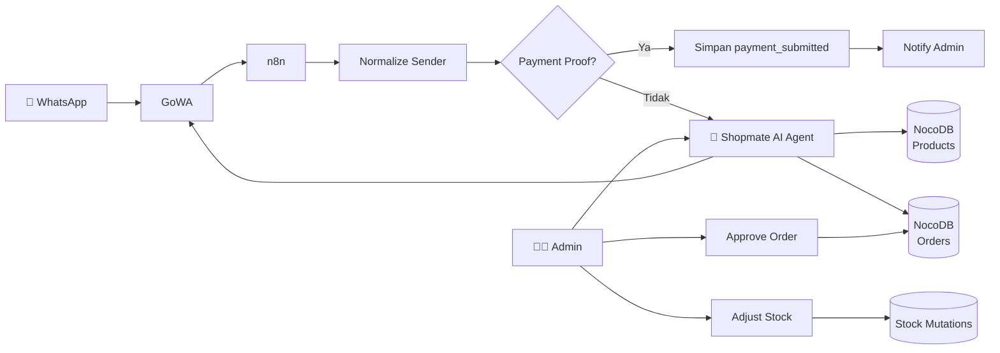

# 🛒 Shopmate — AI Retail WhatsApp Agent

> **Shopmate** adalah AI Agent customer service dan operasional retail berbasis WhatsApp yang membantu customer mencari produk, mengecek harga dan stok, membuat order, memilih metode fulfillment, mengirim bukti pembayaran, serta membantu admin mengelola produk, inventory, order, dan approval.

---

# 📌 Tentang Project

Shopmate dirancang sebagai asisten retail berbasis WhatsApp yang menghubungkan percakapan customer dengan katalog produk, inventory, order, dan proses pembayaran.

Sistem melayani dua jenis pengguna:

| Pengguna | Fungsi |
|---|---|
| 👤 **Customer** | Mencari produk, mengecek harga/stok, membuat order, memilih fulfillment, dan mengirim bukti pembayaran |
| 🧑‍💼 **Admin** | Mengelola produk, harga, stok, order, dan approval |

> **Catatan:** Admin internal saat ini menggunakan nomor `082192791079` dengan format internal `6282192791079`. Admin tidak diperlakukan sebagai customer.

---

# ✨ Fitur Utama

- 🔎 Pencarian produk berdasarkan SKU, nama, kategori, harga, unit, deskripsi, dan stok
- 💰 Melihat dan mengubah harga produk oleh admin
- 📦 Menambah atau mengurangi stok/inventory oleh admin
- 🛒 Membuat order dengan status awal `pending_payment`
- 🏪 Fulfillment `takeaway` dengan ongkir **Rp0**
- 🚚 Fulfillment `dikirimkan` dengan ongkir tetap **Rp10.000**
- 📍 Alamat wajib untuk fulfillment `dikirimkan`
- 🧾 Mendeteksi bukti pembayaran dalam bentuk teks maupun media
- 💳 Mengubah status pembayaran menjadi `payment_submitted`
- 🔔 Mengirim notifikasi bukti pembayaran kepada admin
- ✅ Approval order oleh admin

---

# 🏗️ Arsitektur Sistem



### Komponen Sistem

| Komponen | Peran |
|---|---|
| **WhatsApp** | Media komunikasi customer dan admin |
| **GoWA** | WhatsApp Gateway untuk menerima dan mengirim pesan |
| **n8n** | Workflow automation dan AI Agent |
| **NocoDB** | Database management untuk katalog, inventory, dan order |
| **PostgreSQL** | Database backend NocoDB |
| **AI Agent** | Memahami kebutuhan pengguna dan menjalankan tool yang sesuai |

---

# 🔄 Alur Customer

```text
Customer
   ↓
WhatsApp
   ↓
GoWA
   ↓
n8n Webhook
   ↓
Normalize Sender
   ↓
Shopmate AI Agent
   ↓
Product Catalog / Order Tools
   ↓
NocoDB
   ↓
GoWA
   ↓
WhatsApp Customer
```

### Proses Order

1. Customer menanyakan produk atau harga.
2. Agent **wajib membaca katalog Shopmate**, bukan menggunakan daftar produk statik.
3. Jika customer ingin melakukan order, agent mengumpulkan:
   - Produk
   - Jumlah
   - Nama
   - Catatan jika diperlukan
4. Customer memilih metode fulfillment:
   - `takeaway`
   - `dikirimkan`
5. Agent menampilkan:
   - Subtotal
   - Ongkir
   - Alamat jika diperlukan
   - Total pembayaran
6. Setelah customer memberikan **konfirmasi eksplisit**, order dibuat dengan status `pending_payment`.
7. Customer melakukan pembayaran dan mengirim bukti pembayaran.
8. Workflow menyimpan bukti pembayaran dan mengubah status menjadi `payment_submitted`.
9. Admin melakukan approval order.

---

# 🚚 Fulfillment

Shopmate menyediakan dua metode fulfillment.

### 🏪 Takeaway

```text
Fulfillment
    ↓
takeaway
    ↓
Ongkir = Rp0
```

Customer mengambil pesanan secara langsung.

### 🚚 Dikirimkan

```text
Fulfillment
    ↓
dikirimkan
    ↓
Alamat wajib
    ↓
Ongkir = Rp10.000
```

Agent harus meminta alamat sebelum order dapat diselesaikan.

---

# 🧑‍💼 Alur Admin

Admin dapat melakukan operasi seperti:

```text
cek harga produk SKU DIY-001
edit harga produk SKU DIY-001 menjadi Rp30.000
tambah stok Shampoo Demo 10 botol
cek order #4
approve order #4
```

### Hak akses Admin

Admin dapat:

- Mengubah informasi produk
- Mengubah harga
- Menambah stok
- Mengurangi stok
- Mencari order
- Melakukan approval order

Customer tidak diberikan akses ke operasi administratif tersebut.

> Approval order menggunakan **Order ID** agar target order dapat diidentifikasi dengan jelas.

---

# 💳 Status Order & Pembayaran

Alur status order utama:

```text
pending_payment
       ↓
payment_submitted
       ↓
confirmed
```

### `pending_payment`

Order telah dibuat setelah customer memberikan konfirmasi, tetapi pembayaran belum dikirim atau belum disubmit.

### `payment_submitted`

Customer telah mengirim bukti pembayaran dan workflow telah menyimpan informasi tersebut.

### `confirmed`

Order telah mendapatkan approval admin atau telah melewati proses operasional yang sah.

> Approval admin tidak mensyaratkan `payment_proof_url`. Bukti pembayaran merupakan bagian dari alur customer, bukan syarat wajib untuk menjalankan tool approval.

---

# 🤖 Komponen Tool

Workflow/tool utama Shopmate:

| Tool / Workflow | Fungsi |
|---|---|
| `Shopmate Product Catalog` | Mencari dan membaca katalog produk |
| `Shopmate Update Product` | Mengubah data produk |
| `Shopmate Adjust Stock` | Menambah atau mengurangi stok |
| `Shopmate Create Order` | Membuat order customer |
| `Shopmate Search Order` | Mencari order |
| `Shopmate Submit Payment Proof` | Menyimpan bukti pembayaran |
| `Shopmate Approve Order` | Melakukan approval order |
| `Shopmate Notify Admin Payment Proof` | Memberikan notifikasi pembayaran kepada admin |

### NocoDB Mutation

Tool yang melakukan perubahan data menggunakan mapping eksplisit seperti:

```text
mapWithFields
schema
matchingColumns
```

Mapping eksplisit digunakan agar field yang dimodifikasi sesuai dengan struktur database dan mengurangi risiko kesalahan mapping.

---

# 🗄️ Database

Shopmate menggunakan **NocoDB** dengan **PostgreSQL** sebagai database backend.

### Tabel utama

```text
products
stock_mutations
orders
order_items
payment_submissions
```

### `products`

Menyimpan informasi katalog:

```text
SKU
Nama
Kategori
Harga
Unit
Deskripsi
Stok
```

### `stock_mutations`

Mencatat perubahan inventory, termasuk penambahan dan pengurangan stok.

### `orders`

Menyimpan data utama transaksi customer.

### `order_items`

Menyimpan detail produk dan jumlah yang terdapat dalam order.

### `payment_submissions`

Menyimpan informasi terkait bukti pembayaran yang dikirim customer.

---

# 🔌 Integrasi

| Service | Keterangan |
|---|---|
| **GoWA** | WhatsApp Gateway |
| **n8n** | Automation & AI Agent |
| **NocoDB** | Database Management |
| **PostgreSQL** | Database Backend |

Endpoint yang digunakan pada environment project:

```text
n8n    → https://n8n.saidhr.my.id
GoWA   → https://wa.saidhr.my.id
NocoDB → https://noco.saidhr.my.id
```

> Endpoint tersebut merupakan konfigurasi environment project. Untuk deployment pada server atau Docker environment lain, sesuaikan dengan host/domain masing-masing.

---

# ⚙️ Setup & Deployment

## 1. Persiapkan n8n

Shopmate dijalankan menggunakan n8n.

Workflow dapat di-import melalui:

```text
n8n
→ Workflows
→ Import from File
→ pilih file workflow .json
```

## 2. Persiapkan NocoDB

Pastikan NocoDB dapat diakses dari n8n dan PostgreSQL berjalan sebagai database backend.

## 3. Persiapkan GoWA

GoWA digunakan untuk menerima pesan WhatsApp dan mengirimkan response dari workflow.

## 4. Hubungkan Credential

Credential harus dibuat atau dihubungkan kembali pada environment tujuan.

Credential tidak disimpan di repository publik.

---

# 🧪 Verifikasi

Sebelum sistem digunakan, lakukan pengujian:

- [ ] Customer dapat mengirim pesan melalui WhatsApp
- [ ] GoWA menerima pesan
- [ ] n8n menerima webhook
- [ ] Customer dikenali dengan benar
- [ ] Agent dapat mencari produk
- [ ] Harga dan stok berasal dari katalog NocoDB
- [ ] Customer dapat memilih jumlah produk
- [ ] Customer dapat memilih `takeaway`
- [ ] Customer dapat memilih `dikirimkan`
- [ ] Alamat diminta untuk pengiriman
- [ ] Ongkir takeaway = Rp0
- [ ] Ongkir pengiriman = Rp10.000
- [ ] Order dibuat setelah konfirmasi eksplisit
- [ ] Order masuk sebagai `pending_payment`
- [ ] Bukti pembayaran dapat diterima
- [ ] Status berubah menjadi `payment_submitted`
- [ ] Admin menerima notifikasi
- [ ] Admin dapat melakukan approval
- [ ] Status order menjadi `confirmed`

---

# 🔐 Keamanan

Jangan memasukkan credential atau data produksi ke repository publik.

Jangan commit:

```text
.env
API Key
GoWA Token
NocoDB Token
OpenAI / AI API Key
n8n Credentials
Database Password
Database Dump Produksi
Webhook Secret
```

Export workflow publik harus menggunakan versi yang sudah disanitasi.

Hak akses juga dipisahkan berdasarkan role:

```text
Customer
   ↓
Product / Order
   ✕
Admin Tools

Admin
   ↓
Product
Stock
Order
Approval
```

---

# 📁 Struktur Repository

Struktur repository yang disarankan:

```text
shopmate-ai-agent/
│
├── README.md
│
├── workflow/
│   ├── shopmate-agent.json
│   ├── product-catalog.json
│   ├── create-order.json
│   └── payment-approval.json
│
├── documentation/
│   ├── architecture.md
│   ├── customer-flow.md
│   ├── admin-flow.md
│   ├── database.md
│   └── installation.md
│
└── images/
    ├── architecture.png
    ├── customer-workflow.png
    ├── admin-workflow.png
    └── database.png
```

---

# 📌 Batasan & Catatan

- Agent bergantung pada model AI dan tool NocoDB yang terhubung.
- Credential harus dibuat ulang atau dihubungkan kembali ketika project dipindahkan ke instance n8n lain.
- Pengujian perubahan stok dan approval sebaiknya menggunakan data uji atau ID yang memang diizinkan untuk diubah.
- Katalog produk harus dibaca dari database, bukan dari daftar statik.
- Perubahan inventory sebaiknya dilakukan melalui tool yang memiliki mapping field secara eksplisit.
- Endpoint dan credential harus disesuaikan dengan environment deployment.

---

# 👥 Project Team

| Role | Responsibility |
|---|---|
| AI Agent | Conversation, intent handling, dan tool calling |
| Automation | n8n workflow & integration |
| Database | NocoDB & PostgreSQL |
| WhatsApp Integration | GoWA |
| Retail Operations | Product, inventory, order & payment flow |

---

# 🚀 Project Status

- [x] Customer Service Agent
- [x] Admin Agent
- [x] Product Catalog
- [x] Product Search
- [x] Price Management
- [x] Inventory Management
- [x] Order System
- [x] Takeaway Fulfillment
- [x] Delivery Fulfillment
- [x] Payment Submission
- [x] Payment Approval
- [x] WhatsApp Integration
- [x] NocoDB Integration
- [x] PostgreSQL Backend

---

## 🛒 Shopmate

**AI-powered WhatsApp retail assistant for product, inventory, order, and payment operations.**
